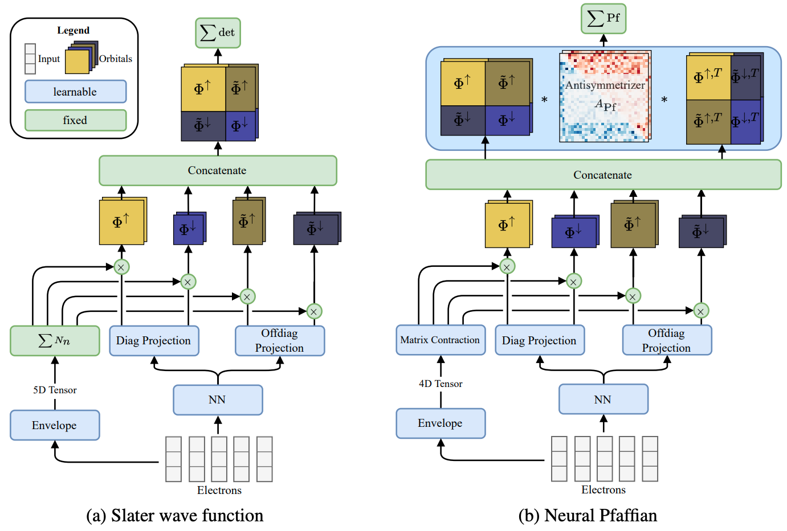

# Neural Pfaffians: Solving Many Many-Electron Schrödinger Equations



Reference implementation of Neural Pfaffians from <be>

<b>[Neural Pfaffians: Solving Many Many-Electron Schrödinger Equations](https://arxiv.org/abs/2405.14762)</b><br>
by Nicholas Gao, Stephan Günnemann<br/>
published as Oral at NeurIPS 2024.

## Installation
1. Install [`uv`](https://docs.astral.sh/uv/):
    ```bash
    curl -LsSf https://astral.sh/uv/install.sh | sh
    ```
2. Create a virtual environment and install dependencies
    ```sh
    uv sync
    source .venv/bin/activate
    ```

## Running the code
We encourage the use of `seml` to manage all experiments, but we also supply commands to run the experiments directly.
With `seml`:
```bash
seml n2_ablation add configs/seml/train_n2.yaml start
```
Without `seml`:
```bash
neural_pfaffian with configs/systems/n2.yaml
```

## Contact
Please contact [n.gao@tum.de](mailto:n.gao@tum.de) if you have any questions.

## Cite
Please cite our paper if you use our method or code in your own works:
```
@inproceedings{gao_pfaffian_2024,
    title = {Neural Pfaffians: Solving Many Many-Electron Schr\"odinger Equations},
    author = {Gao, Nicholas and G{\"u}nnemann, Stephan},
    booktitle = {Neural Information Processing Systems (NeurIPS)},
    year = {2024}
}
```