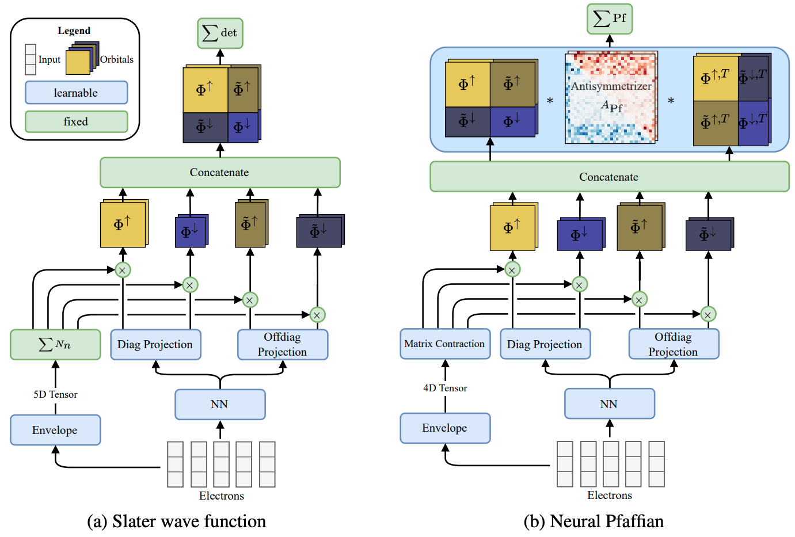

# Neural Pfaffians: Solving Many Many-Electron Schrödinger Equations



Reference implementation of Neural Pfaffians from <be>

> <b>[Neural Pfaffians: Solving Many Many-Electron Schrödinger Equations](https://arxiv.org/abs/2405.14762)</b><br>
by Nicholas Gao, Stephan Günnemann<br/>
published as Oral at NeurIPS 2024.

and

> <b>[Excited Pfaffians: Generalized Neural Wave Functions Across Structure and State](https://arxiv.org/abs/2603.14515)</b><br>
by Nicholas Gao*, Till Grutschus*, Frank Noé, and Stephan Günnemann<br/>
published as Spotlight at ICML 2026.

## Installation

1. Clone the repo:

    ```sh
    git clone git@github.com:n-gao/neural-pfaffian.git
    cd neural-pfaffian
    ```

2. Install [`uv`](https://docs.astral.sh/uv/):

    ```bash
    curl -LsSf https://astral.sh/uv/install.sh | sh
    ```

3. Create a virtual environment and install dependencies:

    ```sh
    uv sync
    source .venv/bin/activate
    ```

    By default `jax` is installed with CPU-support only.
    You can optionally install the `cuda` binaries with:

    ```sh
    uv sync --group cuda12
    ```

    or

    ```sh
    uv sync --group cuda13
    ```

## Models

The code supports various models, FermiNet, PsiFormer, and Moon. In addition to classical Slater determinants and Pfaffian wave functions.
You can also freely configure your desired wave function by editing the modular configuration files.
Note that having no MetaGNN only permits single structure calculations.
Pfaffians as antisymmetrizer are required for running molecules with different nuclei and/or number of electrons.

For instance, to perform a single-structure calculation with PsiFormer run

```sh
neural_pfaffian with config/models/psiformer.yaml config/systems/single/lih.yaml
```

To run PESNet (MetaGNN + FermiNet) on the N2 potential energy surface run

```sh
neural_pfaffian with config/models/pesnet.yaml config/systems/pes/n2.yaml
```

By default, the code uses the Neural Pfaffian (MetaGNN + Moon + Pfaffian) which works for all molecular systems.

## Running the code

We encourage the use of `seml` to manage all experiments, but we also supply commands to run the experiments directly.
With `seml`:

```sh
seml n2_ablation add config/seml/train_n2.yaml start
```

or for an excited-state computation

```sh
seml be_10_states add config/seml/train_be33.yaml start
```

Without `seml`:

```sh
neural_pfaffian with config/systems/n2.yaml
```

or

```bash
neural_pfaffian with config/excited-states/excited-state-defaults.yaml config/systems/excited/be33.yaml
```

## Contact

Please contact [Nicholas Gao](mailto:nicholas@cusp.ai) or [Till Grutschus](mailto:till.grutschus@fu-berlin.de) if you have any questions.

## Cite

Please cite our papers if you use our method or code in your own works.

For **Neural Pfaffians**:

```bibtex
@inproceedings{gao_pfaffian_2024,
    title = {Neural Pfaffians: Solving Many Many-Electron Schr\"odinger Equations},
    author = {Gao, Nicholas and G{\"u}nnemann, Stephan},
    booktitle = {Neural Information Processing Systems (NeurIPS)},
    year = {2024}
}
```

For any **excited-state** work, **Excited Pfaffians**:

```bibtex
@inproceedings{gao_excited_pfaffian_2026,
    title={Excited Pfaffians: Generalized Neural Wave Functions Across Structure and State},
    author={Nicholas Gao and Till Grutschus and Frank Noé and Stephan Günnemann},
    booktitle={Forty-third International Conference on Machine Learning},
    year={2026},
}
```
